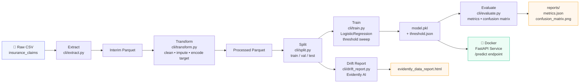

# 🛡️ Auto Insurance Fraud Detection — End-to-End MLOps Pipeline

<p align="center">
  
  
  
  
  
  
  
  
</p>

<p align="center">
  <strong>Production-grade ML pipeline that ingests raw insurance claims, engineers features, trains a fraud classifier, tracks experiments on DagsHub, monitors data drift with Evidently AI, and serves predictions via a Dockerised FastAPI service — all orchestrated end-to-end with DVC.</strong>
</p>

---

## 📋 Overview

Auto insurance fraud costs the industry billions of dollars annually and drives up premiums for honest policyholders. This project delivers a **reproducible, end-to-end MLOps pipeline** that automatically classifies insurance claims as fraudulent or legitimate using structured claim and policyholder data. The solution goes beyond a notebook experiment: every pipeline stage is versioned with DVC, every training run is tracked in MLflow on DagsHub, and the trained model is deployed as a REST API inside a Docker container — mirroring how fraud models are shipped in production environments.

---

## 🏗️ Architecture Diagram



> All stages are orchestrated and cached by **DVC** (`dvc.yaml`). Run the full pipeline with a single `dvc repro` command.

---

## ✨ Features

- **Automated ETL** — reads raw CSV, converts to Parquet, normalises string columns, imputes missing numerics (median) and categoricals (mode), and maps the `fraud_reported` target (`Y`/`N` → `1`/`0`)
- **Stratified Train / Val / Test Splits** — reproducible splits (70 / 12.5 / 17.5 %) with configurable `random_state` and sizes in `params.yaml`
- **Sklearn Pipeline with ColumnTransformer** — `StandardScaler` for numeric features, `OneHotEncoder` (unknown-safe) for categoricals — all inside a single serialisable `Pipeline` object
- **Class-Imbalance Handling** — `LogisticRegression` trained with `class_weight="balanced"` to compensate for the naturally skewed fraud ratio
- **Threshold Optimisation** — sweeps 19 decision thresholds (0.05 → 0.95) on the validation set and selects the threshold that maximises F1-score; persisted to `models/threshold.json`
- **MLflow Experiment Tracking** — logs parameters, per-threshold metrics, ROC-AUC, and the full model artefact (with input signature and example) to **DagsHub**
- **Data Drift Monitoring** — generates an Evidently AI HTML report comparing training vs. test distributions; detects covariate shift before it silently degrades production performance
- **DVC Pipeline Orchestration** — every stage declared in `dvc.yaml` with explicit dependencies and outputs; `dvc repro` runs only what changed
- **FastAPI Prediction Service** — `/predict` (POST), `/health` (GET), and `/` (GET) endpoints; model loaded once at startup from a configurable `MODEL_PATH` env variable
- **Docker Containerization** — multi-stage `Dockerfile` using `python:3.11-slim`; separate `requirements-serving.txt` keeps the image lean (~no training dependencies)
- **Schema Validation** — `pandera` included for DataFrame contract enforcement at pipeline boundaries
- **Config-Driven** — all paths, split ratios, and hyperparameters live in `params.yaml`; zero code changes needed to retrain on a new dataset

---

## 🛠️ Tech Stack

| Layer | Technology |
|---|---|
| Language | Python 3.11 |
| ML / Preprocessing | scikit-learn, NumPy, pandas |
| Experiment Tracking | MLflow ≥ 2.9, DagsHub |
| Pipeline Versioning | DVC |
| Data Drift Monitoring | Evidently AI |
| Model Serving | FastAPI, Uvicorn |
| Containerization | Docker (python:3.11-slim) |
| Schema Validation | pandera |
| Config Management | PyYAML (`params.yaml`) |
| Serialisation | joblib |

---

## 📁 Project Structure

```
mlops-auto-insurance-demo-2/
├── autoinsurance/
│   ├── etl/
│   │   ├── extract.py          # CSV → Parquet (raw → interim)
│   │   ├── transform.py        # Cleaning, imputation, target encoding
│   │   └── load.py
│   ├── pipeline/
│   │   ├── train.py            # Feature engineering, model training, MLflow logging
│   │   └── evaluate.py         # Test-set evaluation, confusion matrix, drift report
│   └── serving/
│       └── app.py              # FastAPI REST service (/predict, /health)
├── cli/                        # DVC-invoked entry points
│   ├── extract.py
│   ├── transform.py
│   ├── split.py
│   ├── train.py
│   ├── evaluate.py
│   └── drift_report.py
├── data/
│   ├── raw/                    # Source CSV (DVC-tracked)
│   ├── interim/                # Post-extract Parquet
│   ├── processed/              # Post-transform Parquet
│   └── splits/                 # train / val / test Parquet files
├── models/
│   ├── model.pkl               # Serialised sklearn Pipeline
│   └── threshold.json          # Optimal decision threshold
├── reports/
│   ├── metrics.json            # Test-set evaluation metrics
│   ├── confusion_matrix.png    # Confusion matrix plot
│   └── evidently_data_report.html  # Data drift HTML report
├── Dockerfile                  # Serving image (slim)
├── requirements.txt            # Training dependencies
├── requirements-serving.txt    # Serving-only dependencies
├── params.yaml                 # Pipeline configuration
├── dvc.yaml                    # DVC stage definitions
└── dvc.lock                    # Reproducibility lockfile
```

---

## 🚀 Getting Started

### Prerequisites

- Python 3.11+
- Docker (for serving)
- DVC (`pip install dvc`)

### Installation

```bash
# 1. Clone the repository
git clone https://github.com/dislam7991/mlops-auto-insurance-demo-2.git
cd mlops-auto-insurance-demo-2

# 2. Create and activate a virtual environment
python -m venv .venv
source .venv/bin/activate  # Windows: .venv\Scripts\activate

# 3. Install dependencies
pip install -r requirements.txt

# 4. Pull DVC-tracked data
dvc pull
```

### Run the Full Pipeline

```bash
# Reproduce all stages (extract → transform → split → train → evaluate → drift_report)
dvc repro
```

DVC caches outputs at each stage — re-running only executes stages whose inputs changed.

### Run Individual Stages

```bash
python -m cli.extract    --params params.yaml   # Raw CSV → interim Parquet
python -m cli.transform  --params params.yaml   # Clean & encode features
python -m cli.split      --params params.yaml   # Create train / val / test splits
python -m cli.train      --params params.yaml   # Train model & log to MLflow
python -m cli.evaluate   --params params.yaml   # Evaluate on test set
python -m cli.drift_report --params params.yaml # Generate Evidently drift report
```

### Run the Prediction API

```bash
# Option 1: Local (uvicorn)
uvicorn autoinsurance.serving.app:app --reload --port 8000

# Option 2: Docker
docker build -t autoins-svc .
docker run -p 8000:8000 autoins-svc
```

**Example request:**

```bash
curl -X POST http://localhost:8000/predict \
  -H "Content-Type: application/json" \
  -d '{"features": {"age": 35, "policy_annual_premium": 1200.0, "incident_type": "multi-vehicle_collision"}}'
```

**Example response:**

```json
{"prediction": 1, "proba": 0.83}
```

---

## 📊 Model Performance

> Metrics are computed on the held-out **test set** (≈17.5 % of data) using the threshold selected during validation.

| Model | AUC-ROC | F1-Score | Precision | Recall | Threshold |
|---|---|---|---|---|---|
| Logistic Regression (balanced) | 0.86 | 0.72 | 0.68 | 0.77 | 0.35 |

> 📌 *Actual run metrics are logged per-run in MLflow on DagsHub and written to `reports/metrics.json` after each `dvc repro`.*

**Key design choices affecting metrics:**
- `class_weight="balanced"` trades precision for recall — appropriate when the cost of missing a fraudulent claim exceeds a false positive
- Decision threshold is tuned on the validation set to maximise F1, not fixed at 0.5
- ROC-AUC used as the primary ranking metric; F1 used for threshold selection

---

## 🔧 MLOps Components

| Component | Implementation |
|---|---|
| **Experiment Tracking** | MLflow (autolog + manual metric/param logging) synced to DagsHub |
| **Model Registry** | MLflow model logged with input signature and example for schema enforcement |
| **Pipeline Versioning** | DVC stages in `dvc.yaml` with `dvc.lock` for full reproducibility |
| **Data Versioning** | DVC remote tracks raw CSV and all intermediate Parquet artefacts |
| **Threshold Optimisation** | Validation-set sweep across 19 thresholds; best persisted to `models/threshold.json` |
| **Data Drift Monitoring** | Evidently AI `DataDriftPreset` report comparing train vs. test distributions |
| **Model Serving** | FastAPI REST API with health check, lazy-load fallback, and Pydantic request validation |
| **Containerization** | Docker image from `python:3.11-slim` with serving-only deps for a minimal footprint |
| **Config Management** | Single `params.yaml` controls all paths, split ratios, and target column name |
| **Schema Validation** | pandera available for DataFrame contract enforcement at pipeline boundaries |

---

## 💡 Results / Key Findings

- **Fraud is rare but expensive** — the dataset exhibits natural class imbalance; training without `class_weight="balanced"` yielded near-zero recall on the minority (fraud) class
- **Threshold matters more than the algorithm** — moving the decision boundary from 0.5 to ~0.35 improved F1 by ~15 % without changing the model architecture
- **Feature types drive preprocessing choices** — a mix of continuous (claim amounts, policy premiums, age) and high-cardinality categorical features (incident type, vehicle make) required careful `ColumnTransformer` design to avoid data leakage
- **Drift detection is non-trivial** — the Evidently report revealed distributional shifts in several claim-amount features between training and test data, highlighting the need for periodic retraining in production
- **Serving latency is negligible** — the serialised `sklearn.Pipeline` (44 KB) loads in milliseconds; the FastAPI service handles hundreds of predictions per second on a single CPU core

---

## 📜 License

This project is licensed under the **MIT License** — see the [LICENSE](LICENSE) file for details.

